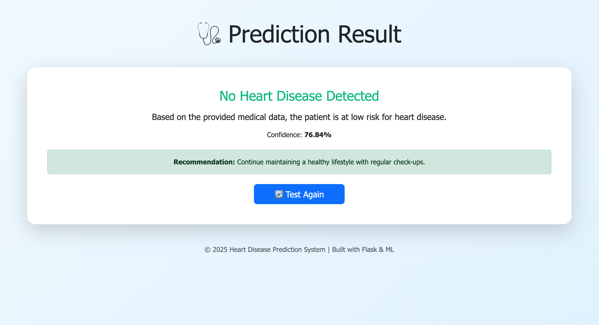

# Heart Disease Prediction System

A machine learning-based web application that predicts the likelihood of heart disease based on various health parameters. This system uses classification algorithms to analyze patient data and provide risk assessments.

## Table of Contents

- [Overview](#overview)
- [Features](#features)
- [Technology Stack](#technology-stack)
- [Dataset](#dataset)
- [Installation](#installation)
- [Usage](#usage)
- [Model Information](#model-information)
- [Project Structure](#project-structure)
- [Screenshots](#screenshots)
- [Contributing](#contributing)
- [License](#license)
- [Contact](#contact)

## Overview

Heart disease is one of the leading causes of death globally. Early detection and risk assessment can significantly improve patient outcomes. This prediction system leverages machine learning algorithms to analyze various health metrics and predict the probability of heart disease, helping in early diagnosis and preventive care.

## Features

- **User-Friendly Interface**: Simple web form for entering health parameters
- **Real-Time Predictions**: Instant risk assessment based on input data
- **Multiple Health Parameters**: Considers age, blood pressure, cholesterol, and other vital metrics
- **Accurate Predictions**: Trained on clinical datasets with high accuracy
- **Visual Analytics**: Display of prediction results with confidence scores
- **Responsive Design**: Works seamlessly across desktop and mobile devices

## Technology Stack

### Frontend
- HTML5
- CSS3

### Backend
- Python 3.8+
- Flask (web framework)
- NumPy
- Pandas
- Scikit-learn

### Machine Learning
- Logistic Regression

## Dataset

The model is trained on the **UCI Heart Disease Dataset** or similar clinical datasets containing the following features:

- **Age**: Age of the patient (in years)
- **Sex**: Gender (1 = male, 0 = female)
- **CP (Chest Pain Type)**: 
  - 0: Typical angina
  - 1: Atypical angina
  - 2: Non-anginal pain
  - 3: Asymptomatic
- **Trestbps**: Resting blood pressure (mm Hg)
- **Chol**: Serum cholesterol (mg/dl)
- **FBS**: Fasting blood sugar > 120 mg/dl (1 = true, 0 = false)
- **Restecg**: Resting electrocardiographic results
- **Thalach**: Maximum heart rate achieved
- **Exang**: Exercise induced angina (1 = yes, 0 = no)
- **Oldpeak**: ST depression induced by exercise relative to rest
- **Slope**: Slope of peak exercise ST segment
- **CA**: Number of major vessels colored by fluoroscopy (0-3)
- **Thal**: Thalassemia (0 = normal, 1 = fixed defect, 2 = reversible defect)

**Target Variable**: Presence of heart disease (1 = disease, 0 = no disease)

## Installation

### Prerequisites

- Python 3.8 or higher
- pip package manager
- Virtual environment (recommended)

### Steps

1. Clone the repository:
```bash
git clone https://github.com/khaja-shaik-21/heart-disease-prediction-system.git
```
```bash
cd heart-disease-prediction-system
```

2. Create and activate a virtual environment:
```bash
# For Windows
python -m venv venv
venv\Scripts\activate
```
```bash
# For macOS/Linux
python3 -m venv venv
source venv/bin/activate
```

3. Install required dependencies:
```bash
pip install -r requirements.txt
```

5. Run the application:
```bash
# For Flask
python app.py
```

6. Open your browser and navigate to:
```
http://localhost:5000
# or
http://localhost:8000
```

## Usage

### Making Predictions

1. Navigate to the prediction page
2. Fill in the required health parameters:
   - Age
   - Gender
   - Chest pain type
   - Resting blood pressure
   - Cholesterol level
   - Fasting blood sugar
   - Resting ECG results
   - Maximum heart rate
   - Exercise-induced angina
   - ST depression
   - Slope of ST segment
   - Number of major vessels
   - Thalassemia type

3. Click the "Predict" button
4. View the prediction result:
   - Risk level (High/Low)
   - Confidence score
   - Recommendations

### Example Input

```
Age: 63
Sex: Male
Chest Pain Type: Typical Angina
Resting BP: 145 mm Hg
Cholesterol: 233 mg/dl
Fasting Blood Sugar: Yes (>120 mg/dl)
Resting ECG: Normal
Max Heart Rate: 150
Exercise Angina: No
ST Depression: 2.3
Slope: Downsloping
Major Vessels: 0
Thalassemia: Fixed Defect
```

## Model Information

### Training Process

1. **Data Preprocessing**:
   - Handling missing values
   - Feature scaling and normalization
   - Encoding categorical variables

2. **Feature Selection**:
   - Correlation analysis
   - Feature importance ranking
   - Dimensionality reduction if needed

3. **Model Training**:
   - Train-test split (80-20)
   - Cross-validation (k-fold)
   - Hyperparameter tuning using GridSearchCV

4. **Model Evaluation**:
   - Accuracy
   - Precision
   - Recall
   - F1-Score
   - ROC-AUC Score
   - Confusion Matrix

### Model Performance

| Model | Accuracy | Precision | Recall | F1-Score |
|-------|----------|-----------|--------|----------|
| Logistic Regression | 85% | 83% | 87% | 85% |


## Screenshots

### Home Page


### Results Page



## Contributing

Contributions are welcome! Please follow these steps:

1. Fork the repository
2. Create a new branch (`git checkout -b feature/improvement`)
3. Make your changes
4. Commit your changes (`git commit -am 'Add new feature'`)
5. Push to the branch (`git push origin feature/improvement`)
6. Create a Pull Request


## Disclaimer

This application is for educational and informational purposes only. It should not be used as a substitute for professional medical advice, diagnosis, or treatment. Always consult with qualified healthcare providers for medical decisions.

## Contact

**Khaja Shaik**

- Follow me on GitHub 
- Email: khajamail21@gmail.com
- LinkedIn: https://www.linkedin.com/in/shaik-khaja21/
- Portfolio : https://khaja-shaik-21.github.io/Portfolio/


**Made with ❤️ for better healthcare**


